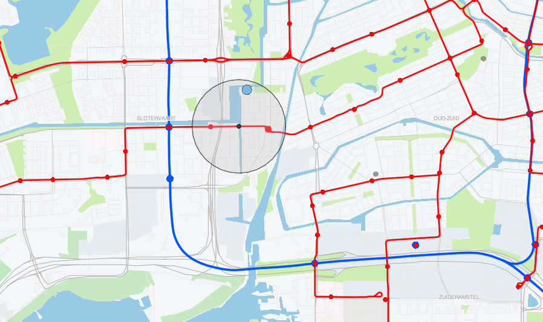

# HERE ctive Map Layer: Spatial and Property Search Example 2

Features stored in interactive map layers can be retrieved by spatial and/or property search queries. The spatial search query can be used to retrieve features that intersect a given point, line or area. This can be provided to the API as a GeoJSON geometry. Additionally, a radius parameter defined in meters could be specified.

The property search query can be used to retrieve features that have a property value that matches a given value. It is possible to search for numeric ranges, to query multiple property values, and to combine the queries using logical operators. Property search can be combined with requests for tile, bounding box and spatial search.

This example includes a map to explore sport facilities, public transport lines and stations in the city of Amsterdam. Property search is used to filter the features by the sport type. It is combined with spatial search to find the facilities of that type located near a selected public transport station or all of the stations for a selected transport line.

__[Live example](https://heremaps.github.io/here-interactive-map-layer-examples/examples/spatial-and-property-search-1/index.html)__

## Getting Started

### Clone this repository

    git clone https://github.com/heremaps/here-interactive-map-layer-examples.git

    cd here-interactive-map-layer-examples

### Install dependencies

    yarn install

### Set your API key

Set your [HERE platform API Key](https://developer.here.com/documentation/identity-access-management/dev_guide/topics/plat-using-apikeys.html).

    yarn set-api-key <YOUR_API_KEY>

### Build and launch the examples

To only build the examples, run:

    yarn build

Or alternatively, to build the examples, serve them locally and open them in the browser use the following command:

    yarn start

# License

Copyright (C) 2021-2022 HERE Europe B.V.

This project is licensed under the Apache License, Version 2.0 - see the [LICENSE](LICENSE) file for details